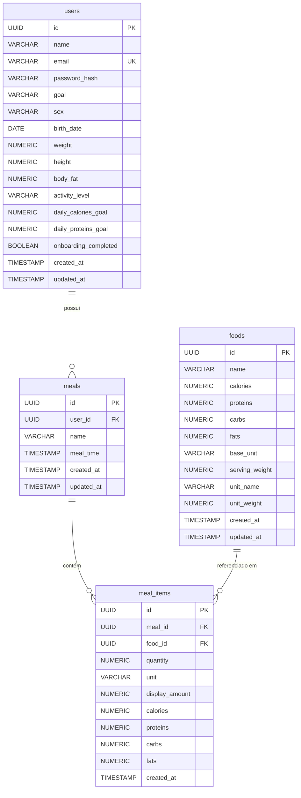

# Arquitetura (ARCHITECTURE.md)

## Visão Geral
Aplicação Full-stack organizada em uma estrutura de múltiplos projetos via subpastas, utilizando `npm --prefix` no `package.json` da raiz para orquestrar os scripts. Separação clara entre cliente SPA (React) e servidor API (Node.js/Express).

## Modelo e Fluxo de Dados

```mermaid
flowchart TD
    A[Usuário/Navegador] -->|Interage| B(React App - Vite)
    B -->|React Query - HTTP/JSON| C{Express API - Backend}
    C -->|Controllers| D[Middlewares - Auth/Zod]
    D -->|Validação OK| E[Services - Regra de Negócio]
    E -->|Model| F[(PostgreSQL)]
    F -.->|Retorna Dados| E
    E -.->|Formata Resposta| C
    C -.->|JSON {success, data}| B
```

## Modelo de Dados (ER Diagram)



## Módulos e Responsabilidades

### Backend (`/backend`)
- **Controllers:** Tradução HTTP, parseamento, formatação da resposta `{ success, data, message }`.
- **Services:** Regras de negócio (ex: cálculo de calorias e macros de uma refeição).
- **Models:** Conexão direta via `pg` com o PostgreSQL. [CONFIRMADO]
- **Middlewares:** Autenticação via JWT, tratamento global de erros, validação de schemas Zod.

### Frontend (`/frontend`)
- **Components:** UI baseada em Radix e Tailwind. Isolamento estrito de componentes de página.
- **Services (API Client):** Função utilitária customizada `apiFetch` utilizando `fetch` nativo do navegador (`frontend/src/services/api.ts`).
- **React Query:** Gerenciamento do estado assíncrono e cache, revalidação após mutações.
- **Zod:** Validação no cliente antes do envio.

## Decisões Técnicas Relevantes
- **Zod Full-stack:** [CONFIRMADO] Zod é utilizado em ambas as pontas para garantir consistência dos contratos (schemas).
- **Node Native Test Runner:** [CONFIRMADO] Utilização do `node:test` integrado com o `tsx`, evitando o peso extra do Jest, mantendo velocidade e simplicidade.
- **Postgres Direto (`pg`):** [CONFIRMADO] Não há indícios do Prisma ORM no momento, os scripts e queries rodam de forma mais direta/SQL puro (`init-db.js`, `database/`).
- **Radix UI:** [CONFIRMADO] Escolhido para garantir a fundação de acessibilidade de forma nativa e agilizar criação de modais semânticos.
